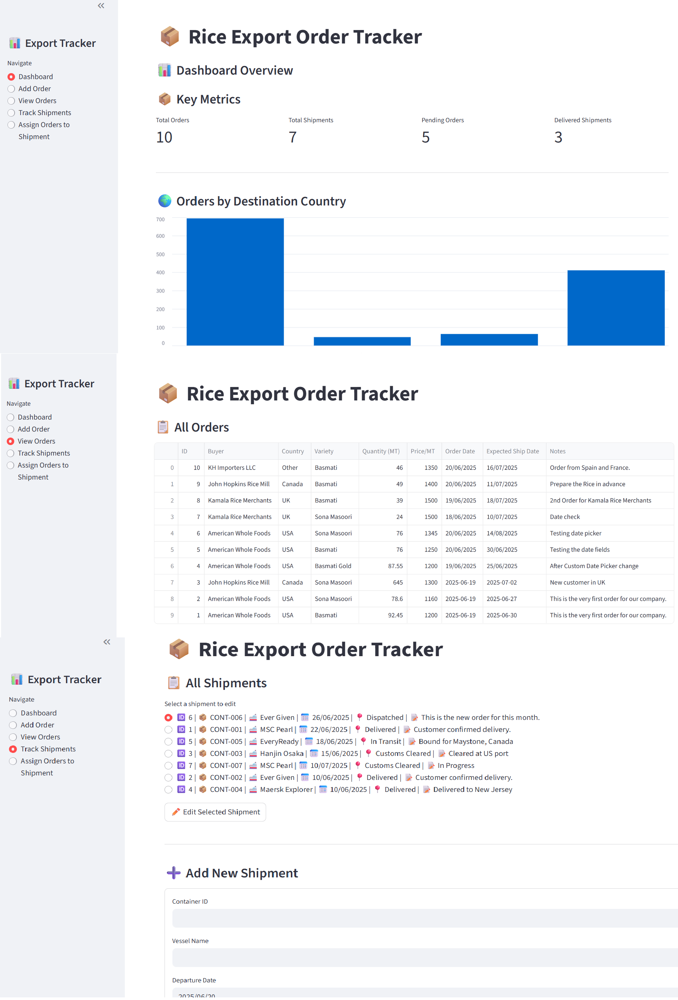

# 📦 Rice Export Tracker

A lightweight Streamlit-based application for managing rice export orders, tracking international shipments, and gaining insights via a simple dashboard. Built using Python and SQLite — ideal for small businesses exporting rice to the USA, UK, Canada, and other countries.

---

## 🚀 Features

### 📦 Orders
- Add new export orders with buyer, country, rice variety, quantity, price, and shipping dates.
- View all orders in a searchable, filterable table.

### 🚢 Shipments
- Create and manage shipment records with container ID, vessel, departure date, and status.
- Assign multiple export orders to a shipment.
- Track shipping status: Dispatched, In Transit, Customs Cleared, Delivered.
- Edit existing shipments and update status/notes.

### 📊 Dashboard
- View total orders, shipment progress summary, and top destination countries.
- Export quantity analytics and charts.

---

## 🛠️ Tech Stack

| Component    | Tech        |
|--------------|-------------|
| Frontend     | [Streamlit](https://streamlit.io/) |
| Backend      | Python 3.12 |
| Database     | SQLite      |
| Version Ctrl | Git + GitHub |

---

---

## ▶️ How to Run Locally

1. **Clone the repository**
```bash
git clone https://github.com/your-username/Rice_Export_Tracker.git
cd Rice_Export_Tracker
```
2. **Create a virtual environment**
```bash  
python -m venv .venv
# Windows
.venv\Scripts\activate
# macOS/Linux
source .venv/bin/activate```
```
3. **Install dependencies** 
pip install -r requirements.txt
4. **Run the app**
streamlit run app.py

## ▶️ Screenshots



## 💡 Future Enhancements
Authentication & role-based access

Export to Excel/CSV

SMS/email notifications

Container tracking API integration

Web-based dashboard UI (HTML/JS)

## License
This project is open-source and available under the [MIT License].

## 📬 Contact
Developer: Rajesh R M
📧 [rm.rajesh.mkumar@gmail.com]
🔗 LinkedIn [https://www.linkedin.com/in/rajesh-r-m-85363423a/]